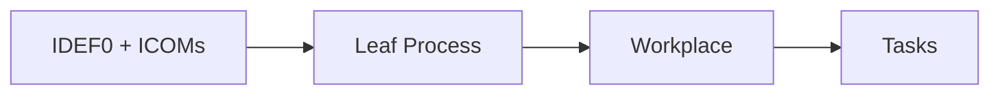
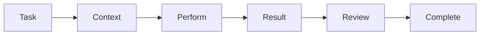
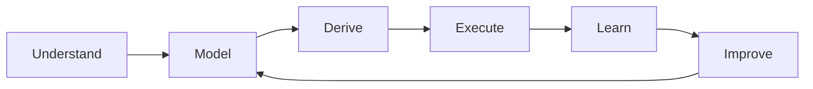

# From Process Models to AI-Assisted Task Execution

Process models traditionally describe how work should be performed. Mimris takes this one step further: **the model can provide the context for actually performing the work.**

The central idea is simple:

**Process → Workplace → Task → AI-Assisted Execution → Result**

## From Process to Workplace

Mimris uses IDEF0 processes with their ICOMs:

- **Input** — what the process works on
- **Control** — what governs the work
- **Output** — what should be produced
- **Mechanism** — people, systems and tools available to perform it

Processes can be decomposed until reaching **leaf processes** representing sufficiently concrete areas of work.

From a leaf process, Mimris can derive a **Workplace** containing the Information, Roles, Tasks and Views required to perform that work.

## The Task Is the Unit of Execution

The important part is that Mimris Task Execution is **generic**.

A Task is not restricted to executing a process step or calling an AI prompt. It represents a unit of work that produces or modifies something.

For example, a Task can:

- create a document;
- create or modify a model;
- perform an analysis;
- create a diagram;
- review an existing result;
- transform information;
- support a decision;
- interact with another system.

The execution pattern remains essentially the same:

What changes is the Task definition, its context and the type of result being produced.

## AI-Assisted Execution

AI assistance is built into this execution model.

Because the Task belongs to a modelled Workplace, Mimris already has structured knowledge about the work. The execution context can be assembled from the Task, process and ICOMs, Workplace, relevant information, models and documents, and the user's request.

> **The model provides the context. The Task defines the work. AI assists in performing it.**

The human can direct, modify, review and approve the result, while the amount of work performed by AI can vary according to the Task.

## One Architecture, Different Results

The same Task Execution architecture can support very different kinds of work.

| Task | AI-assisted execution | Result |
| --- | --- | --- |
| Document | Research, structure, draft, review | Document |
| Modelling | Transform and structure knowledge | Model |
| Analysis | Interpret information and identify findings | Findings |
| Review | Compare result with controls and requirements | Approved or modified result |

Mimris therefore does not need separate execution architectures for documents, models, analyses and future artefact types. They are different applications of the same generic Task concept.

## Top-Down and Bottom-Up

Mimris combines Task Execution with both **top-down and bottom-up modelling**.

Top-down provides intent:

**Domain → Process → Workplace → Task**

Bottom-up provides knowledge about existing reality:

**Systems + Data + Documents + Existing Models + Working Practices → As-Is**

This matters because new Tasks and Workplaces rarely start from nothing. They must often use, integrate with, replace or adapt to existing solutions.

Execution creates another bottom-up flow:

**Task Execution → Results → As-Performed Knowledge → Model Improvement**

Bottom-up therefore serves two purposes: **before execution**, understand what already exists; **after execution**, learn from what actually happens.

## From Models to Working Knowledge

This creates a continuous cycle:

What makes Mimris distinctive is not simply process modelling, Tasks or generative AI. It is their connection.

IDEF0 processes and ICOMs establish context. Leaf processes provide the basis for Workplaces. Workplaces provide model-grounded Tasks. Tasks provide a generic execution mechanism for documents, models, analyses and other work. AI assists execution using the relevant model-derived context. Bottom-up knowledge connects both existing solutions and actual execution back to the models.

Mimris can therefore move beyond describing work toward a **model-driven, AI-assisted environment for performing work**.
